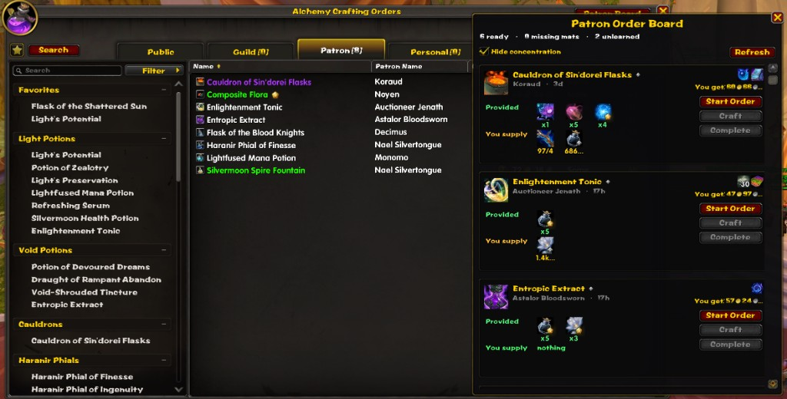

# Patron Order Board

A World of Warcraft addon for **Patron crafting orders**. It shows which reagents the patron already provided and which ones you still have to supply, then lets you start and complete the order from that list — without opening each order.

## What it does

When you open **Crafting Orders > Patron** at your profession table, a board appears next to the profession window.

Each order shows:

- **Provided** — reagents the patron already included (green, with a check)
- **You supply** — reagents you must add, with `have/need` counts (gold if you have them, red if you do not)
- Rewards, time remaining, and whether the recipe is learned
- **Start Order** — claims the order (same as Blizzard's Start Order)
- **Complete** — claims if needed, crafts, then turns the order in

Orders you can finish now are sorted to the top.

## Install

1. Copy the `PatronOrderBoard` folder into:

   `World of Warcraft\_retail_\Interface\AddOns\`

2. Restart WoW (or reload at the character select screen).
3. Enable **Patron Order Board** in the AddOns list.
4. Stand at your crafting table, open the profession, and go to **Crafting Orders > Patron**.

The folder name must stay `PatronOrderBoard`, and it must contain `PatronOrderBoard.toc`.

## Commands

| Command | Action |
| --- | --- |
| `/pob` | Show or hide the board |
| `/pob refresh` | Reload patron orders |
| `/pob dock` | Snap the board to the profession window |
| `/pob undock` | Let you drag the board anywhere |

Drag the title bar to move it. Use `/pob dock` to pin it back.

## Notes

- You still need to be at the crafting table.
- Only one order can be claimed at a time.
- **Complete** skips optional finishing reagents and does not spend Concentration.
- Recraft orders that still need the original item selected may have to be opened once.
- If a one-click complete stops after Start, click **Complete** again. Each click runs the next step (claim → craft → turn in) without opening the order.
